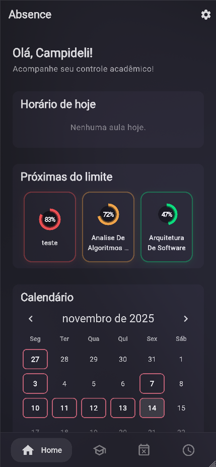
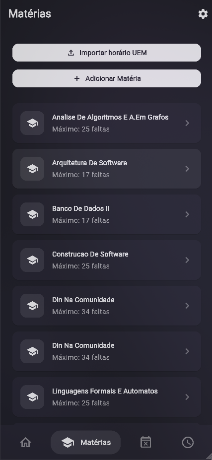
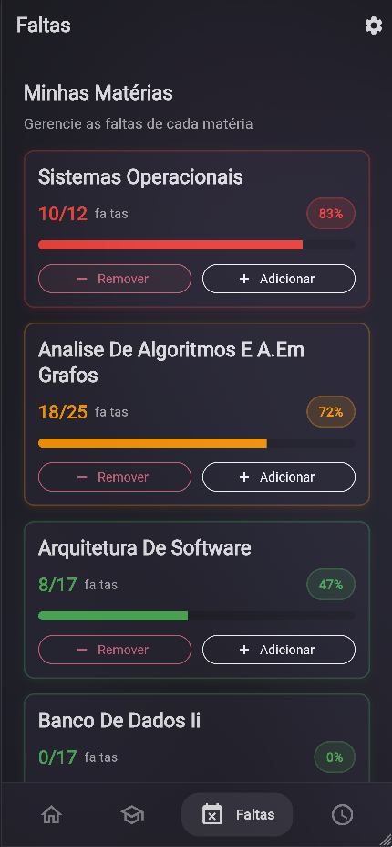

<div align="center">

# 📚 Absence

### Sistema Inteligente de Controle de Faltas Acadêmicas

Um sistema completo para gerenciamento de frequência acadêmica, ajudando estudantes a monitorar suas faltas e evitar reprovação por ausência.

[](https://flutter.dev)
[](https://dart.dev)
[](https://firebase.google.com)
[](LICENSE)

[🌐 **Acessar Aplicação**](https://absence-917f1.web.app/)

---

</div>

## 📋 Sobre o Projeto

**Absence** é uma plataforma full-stack desenvolvida para ajudar estudantes universitários a gerenciar suas faltas de forma inteligente. O sistema oferece:

- 📊 **Dashboard interativo** com estatísticas em tempo real
- 🎯 **Alertas inteligentes** quando próximo ao limite de faltas
- 📅 **Gestão de horários** com visualização de calendário semanal
- 📄 **Importação de PDF** para facilitar o cadastro de matérias
- 🔐 **Autenticação segura** com Firebase e Google Sign-In

---

## 📸 Screenshots

<div align="center">

### Login


### Dashboard


### Gestão de Matérias


### Controle de Faltas


### Visualização de Horário


</div>

---

## 🎯 Funcionalidades

### Frontend (Flutter)

#### 🔐 Autenticação
- ✅ Login com email/senha
- ✅ Autenticação Google (Web & Android)
- ✅ Registro de novos usuários
- ✅ Recuperação de senha
- ✅ Armazenamento seguro de credenciais

#### 📊 Dashboard
- ✅ Saudação personalizada
- ✅ Calendário mensal de faltas
- ✅ Top matérias próximas ao limite
- ✅ Horários do dia
- ✅ Estatísticas em tempo real

#### 📚 Gestão de Matérias
- ✅ CRUD completo de matérias
- ✅ Configuração de limite de faltas
- ✅ Atribuição de horários (dia/hora)
- ✅ Importação via PDF
- ✅ Indicadores de status (seguro/alerta/perigo)
- ✅ Cálculo automático de percentuais

#### 📝 Controle de Faltas
- ✅ Registro de faltas por data
- ✅ Suporte a múltiplas faltas por registro
- ✅ Campo opcional de justificativa
- ✅ Listagem por matéria
- ✅ Sincronização em tempo real

#### 📅 Horários
- ✅ Visualização semanal de aulas
- ✅ Calendário interativo

#### ⚙️ Configurações
- ✅ Gerenciamento de perfil
- ✅ Troca de senha

### Backend (API Server - Dart/Shelf)

- ✅ **API RESTful** completa
- ✅ **Autenticação Firebase** com validação de tokens
- ✅ **Middlewares de segurança** (CORS, Rate Limiting, Headers)
- ✅ **Logging e Auditoria** de requisições
- ✅ **Firestore** como banco de dados
- ✅ **Proxy para PDF Service**

### Microserviço PDF (Python/FastAPI)

- ✅ **Extração de horários** de PDFs da UEM
- ✅ **Parsing inteligente** de matérias e códigos
- ✅ **API REST** para integração
- ✅ **Retorno estruturado** em JSON

---

## 🏗️ Arquitetura

### Estrutura do Monorepo

```
Absence/
├── 📱 apps/
│   └── absence_app/              # Aplicativo Flutter
│       ├── lib/
│       │   ├── main.dart         # Entry point + Firebase + Provider
│       │   ├── config/           # Configurações (app, env, firebase)
│       │   ├── core/             # Infraestrutura
│       │   │   ├── constants/    # Design system (cores, decorações)
│       │   │   ├── network/      # HTTP service com segurança
│       │   │   ├── security/     # Secure storage & sanitização
│       │   │   ├── theme/        # Material 3 theming
│       │   │   └── utils/        # Utilitários (datas, validação)
│       │   ├── features/         # Módulos por feature
│       │   │   ├── auth/         # Autenticação
│       │   │   ├── dashboard/    # Dashboard com widgets
│       │   │   ├── subjects/     # Gestão de matérias
│       │   │   ├── absences/     # Controle de faltas
│       │   │   ├── schedules/    # Calendário de horários
│       │   │   └── settings/     # Configurações
│       │   └── shared/           # Componentes compartilhados
│       │       ├── models/       # Models com json_serializable
│       │       └── widgets/      # Widgets reutilizáveis
│       ├── android/              # Configuração Android
│       ├── ios/                  # Configuração iOS
│       ├── web/                  # Configuração Web
│       └── linux/                # Configuração Linux
│
├── 🖥️ servers/
│   ├── api_server/               # API REST em Dart
│   │   ├── bin/
│   │   │   └── api_server.dart  # Server entry point
│   │   └── lib/src/
│   │       ├── controllers/      # REST controllers
│   │       ├── middleware/       # Auth, CORS, Security, Logs
│   │       ├── models/           # Data models
│   │       ├── routes/           # Definição de rotas
│   │       └── services/         # Firebase Admin, Firestore
│   │
│   └── pdf_service/              # Microserviço Python
│       ├── main.py               # FastAPI app
│       └── requirements.txt      # Dependências Python
│
├── 📜 scripts/
│   └── setup-and-deploy.sh       # Deploy automatizado GCP
│
├── 📝 docs/                      # Documentação
├── melos.yaml                    # Configuração monorepo
└── pubspec.yaml                  # Dependências root
```

### Stack Tecnológica

<table>
<tr>
<td width="33%" valign="top">

#### 📱 Frontend
- **Framework**: Flutter 3.8.1+
- **Linguagem**: Dart 3.8.1+
- **UI/UX**: Material Design 3
- **State Management**: Provider
- **Auth**: Firebase Auth
- **Database**: Cloud Firestore
- **Storage**: Secure Storage
- **HTTP**: http package
- **Serialização**: json_serializable

</td>
<td width="33%" valign="top">

#### 🖥️ Backend
- **Framework**: Shelf (Dart)
- **Roteamento**: shelf_router
- **Auth**: Firebase Admin SDK
- **Database**: Cloud Firestore
- **Logging**: logging package
- **Security**: crypto, sanitização

**PDF Service**:
- **Framework**: FastAPI (Python)
- **Parser**: pdfplumber
- **Server**: uvicorn

</td>
<td width="33%" valign="top">

#### ☁️ DevOps
- **Monorepo**: Melos
- **Hosting**: Firebase Hosting
- **Backend**: GCP Cloud Run
- **CI/CD**: Script automatizado
- **Containers**: Docker
- **Secrets**: GCP Secret Manager
- **Region**: São Paulo (SA)

</td>
</tr>
</table>

---

## 🚀 Início Rápido

### Pré-requisitos

- [Flutter SDK](https://flutter.dev/docs/get-started/install) ≥ 3.8.1
- [Dart SDK](https://dart.dev/get-dart) ≥ 3.8.1
- [Melos](https://melos.invertase.dev/) para gerenciamento do monorepo
- [Firebase CLI](https://firebase.google.com/docs/cli) (para deploy)
- [Python 3.9+](https://www.python.org/) (para PDF service)

### Instalação

1. **Clone o repositório**
```bash
git clone https://github.com/Campideli/Absence.git
cd Absence
```

2. **Instale o Melos globalmente**
```bash
dart pub global activate melos
```

3. **Bootstrap do projeto (instala todas as dependências)**
```bash
melos get
```

4. **Configure as variáveis de ambiente**

Crie arquivo `.env` em `servers/api_server/`:
```env
PORT=8080
HOST=0.0.0.0
ENVIRONMENT=development
FIREBASE_PROJECT_ID=seu-project-id
FIREBASE_PRIVATE_KEY=sua-private-key
FIREBASE_CLIENT_EMAIL=seu-client-email
ALLOWED_ORIGINS=http://localhost:3000
PDF_SERVICE_URL=http://localhost:8000
```

5. **Configure o Firebase**
- Crie um projeto no [Firebase Console](https://console.firebase.google.com)
- Ative Authentication (Email/Password e Google)
- Ative Cloud Firestore
- Baixe as configurações e atualize `lib/config/firebase_options.dart`

---

## 🎮 Executando o Projeto

### Frontend (Flutter App)

```bash
# Web (porta 3000)
melos web

# Android
melos android

# Ou use o comando Flutter direto
cd apps/absence_app
flutter run -d chrome --web-port 3000
```

### Backend (API Server)

```bash
# Inicia o servidor Dart na porta 8080
melos api

# Ou execute diretamente
cd servers/api_server
dart run bin/api_server.dart
```

### PDF Service (Python)

```bash
cd servers/pdf_service

# Instale as dependências
pip install -r requirements.txt

# Inicie o servidor (porta 8000)
uvicorn main:app --reload --port 8000
```

### Scripts Melos Disponíveis

```bash
melos web          # Executa Flutter web (porta 3000)
melos android      # Executa Flutter Android
melos api          # Executa API Dart (porta 8080)
melos get          # Instala dependências de todos os pacotes
melos clean        # Limpa build artifacts
melos kill-port    # Finaliza processos nas portas 3000 e 8080
```

---

## 🔒 Segurança

O projeto implementa diversas camadas de segurança:

### Frontend
- ✅ Armazenamento seguro de tokens (flutter_secure_storage)
- ✅ Sanitização de inputs do usuário
- ✅ Validação de formulários
- ✅ HTTPS em produção

### Backend
- ✅ Validação de tokens Firebase em todas as rotas protegidas
- ✅ Rate limiting por IP (proteção DDoS)
- ✅ CORS restritivo em produção
- ✅ Security headers (XSS, CSP, HSTS)
- ✅ Sanitização de inputs
- ✅ Logging e auditoria de requisições
- ✅ Políticas baseadas em ambiente

---

### Deploy

#### Flutter Web (Firebase Hosting)
```bash
cd apps/absence_app
flutter build web --release
firebase deploy --only hosting
```

#### API Server (Cloud Run)
```bash
cd servers/api_server
gcloud run deploy absence-dart-api \
  --source . \
  --region southamerica-east1 \
  --allow-unauthenticated
```

#### PDF Service (Cloud Run)
```bash
cd servers/pdf_service
gcloud run deploy absence-pdf-service \
  --source . \
  --region southamerica-east1 \
  --allow-unauthenticated
```

---

## 🗺️ Roadmap

### Planejado
- [ ] Exportação completa dos horários do PDF da UEM
- [ ] Suporte a iOS e android
- [ ] Otimizações de fluxos e outras melhorias

---

## 🤝 Contribuindo

Contribuições são bem-vindas! Sinta-se à vontade para:

1. Fazer um Fork do projeto
2. Criar uma branch para sua feature (`git checkout -b feature/AmazingFeature`)
3. Commit suas mudanças (`git commit -m 'Add: nova funcionalidade incrível'`)
4. Push para a branch (`git push origin feature/AmazingFeature`)
5. Abrir um Pull Request

### Convenção de Commits

Utilize o padrão [Conventional Commits](https://www.conventionalcommits.org/):

- `feat:` Nova funcionalidade
- `fix:` Correção de bug
- `docs:` Documentação
- `refactor:` Refatoração de código

---

## 📄 Licença

Este projeto está sob a licença MIT. Veja o arquivo [LICENSE](LICENSE) para mais detalhes.

---

## 👨‍💻 Autor

**Campideli**

- GitHub: [@Campideli](https://github.com/Campideli)

---
